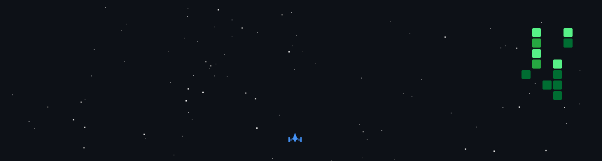
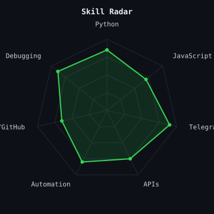
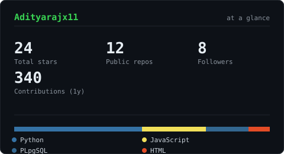

<div align="center">



# Hi, I'm Aditya 👋

Building things that live in the space between Telegram, automation, and "wait, that actually worked?"

<a href="https://your-linkedin-url"></a>
<a href="mailto:your-email@example.com"></a>
<a href="https://your-portfolio-url"></a>

</div>

---

### ~/ whoami

```
$ cat about.txt
```

- Building **RavenStore Bot** — a UPI/QR-payment digital goods store bot on Telegram
- Learning: automation, backend systems, and whatever breaks next
- Fun fact: I started coding to fix problems I ran into, not to follow a course

---

### ~/ contribution battlefield 🚀

<!-- generated + auto-updated by .github/workflows/profile.yml -->


---

### ~/ skill radar



---

### ~/ the numbers



---

### ~/ toolbox

<p>

</p>

---

### ~/ selected work

| project | description | stack |
|---|---|---|
| **RavenStore Bot** | UPI/QR-payment digital goods store on Telegram, tiered admin controls, stock management | Python, pyTelegramBotAPI |

---

<div align="center">
<sub>Last refreshed automatically via GitHub Actions</sub>
</div>
